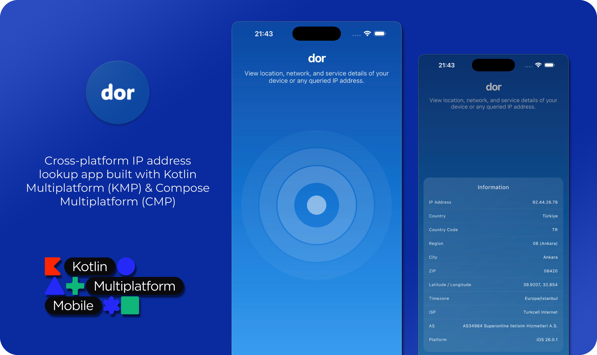
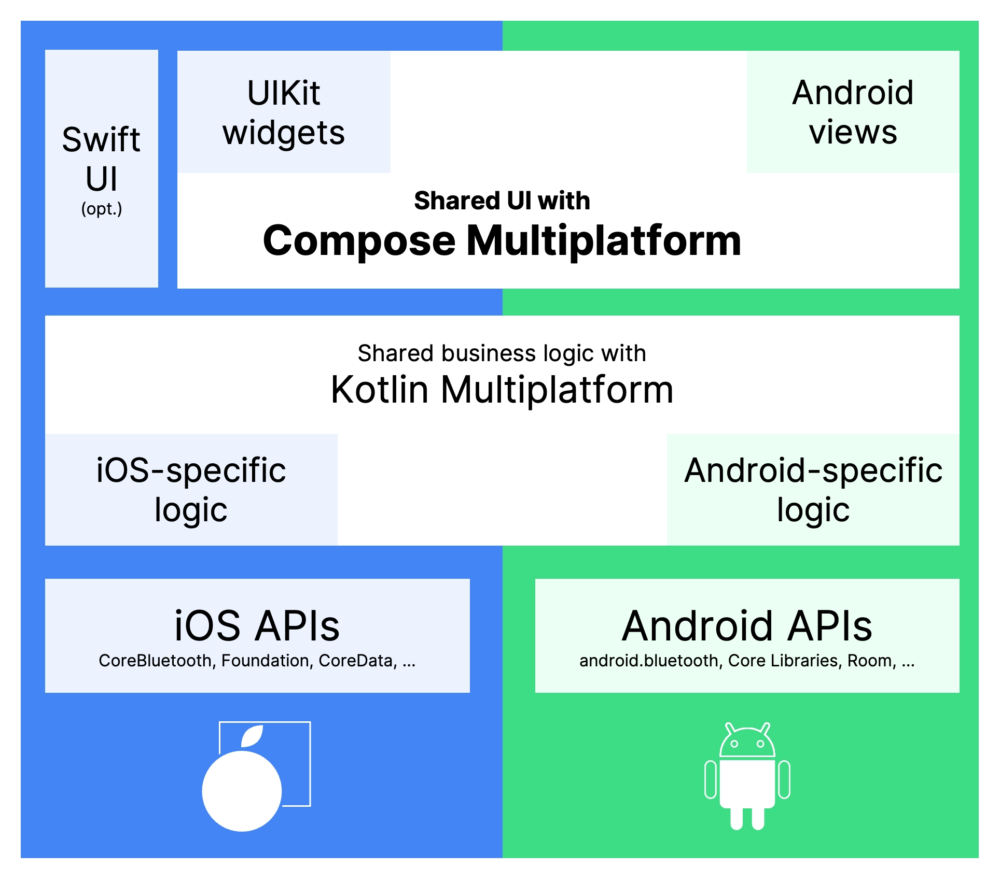

<h1 align="center">
  
  <br>
  IP Address Lookup
</h1>

<p align="center">
  <b>Cross-platform IP address lookup app built with Kotlin Multiplatform (KMP) & Compose Multiplatform (CMP)</b><br>
  <sub>Android & iOS | Shared UI | Shared Logic | Clean Architecture</sub>
</p>

<p align="center">
  
  
  
  
  
</p>

<p align="center">
  
</p>

Android|iOS
--|--
 | 

## Overview

**dor** is a Kotlin Multiplatform (KMP) application that queries IP address information (country, city, ISP, etc.) from a public API and displays the results using **Compose Multiplatform UI** — one codebase, two native platforms (Android & iOS).

| Feature | Description | 
|----------|--------------|
| 🧩 **Toolchain** | Kotlin Multiplatform - KMP (Android + iOS) - Cross-platform language feature & compiler toolchain |
| 🎨 **UI Framework** | Compose Multiplatform - CMP - Cross-platform UI framework |
| 🧱 **Architecture** | MVVM (Model–View–ViewModel) |
| ⚙️ **Build System** | Gradle (KMP setup) |

## Libraries

| Category | Library | Artifact ID | Description |
|-----------|----------|-------------|--------------|
| 🧠 **Language** | [Kotlin](https://kotlinlang.org/) | `org.jetbrains.kotlin:kotlin-test` | Core language & testing utilities |
| 🎨 **UI** | [Compose Multiplatform](https://www.jetbrains.com/lp/compose-multiplatform/) | `org.jetbrains.compose` | Declarative UI shared across Android/iOS |
| 📱 **AndroidX** | [Activity Compose](https://developer.android.com/jetpack/androidx/releases/activity) | `androidx.activity:activity-compose` | Integrates Compose with Android lifecycle |
| 💉 **Dependency Injection** | [Koin](https://insert-koin.io/) | `io.insert-koin:koin-core` / `io.insert-koin:koin-compose-viewmodel` | Lightweight DI for shared & UI layers |
| 🌐 **Networking** | [Ktor](https://ktor.io/) | `io.ktor:ktor-client-core` / `ktor-client-okhttp` / `ktor-client-darwin` | HTTP client for Android & iOS |
| 🔄 **Serialization** | [Kotlinx Serialization](https://github.com/Kotlin/kotlinx.serialization) | `io.ktor:ktor-serialization-kotlinx-json` | JSON parsing for API responses |

## API Service
This application utilizes the [IP-API →](https://ip-api.com/) service to fetch detailed information about IP addresses, including location, ISP, and region data.

## KMP - CMP


Compose Multiplatform is an optional layer for Kotlin Multiplatform applications that allows you to build declarative user interfaces once and use them for multiple target platforms.
[Learn more on JetBrains Blog →](https://blog.jetbrains.com/kotlin/2023/05/compose-multiplatform-for-ios-is-in-alpha/)

## License

```
Licensed under the Apache License, Version 2.0 (the "License");
you may not use this file except in compliance with the License.
You may obtain a copy of the License at

    https://www.apache.org/licenses/LICENSE-2.0

Unless required by applicable law or agreed to in writing, software
distributed under the License is distributed on an "AS IS" BASIS,
WITHOUT WARRANTIES OR CONDITIONS OF ANY KIND, either express or implied.
See the License for the specific language governing permissions and
limitations under the License.

